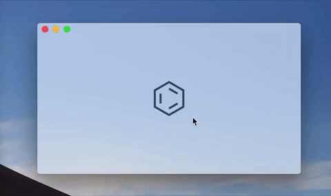
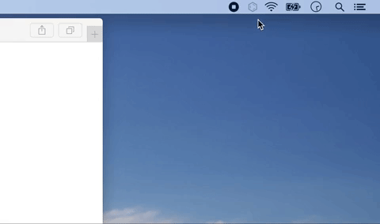

# Soundtrack ⌬

Soundtrack is a minimal music player for macOS. You give it a URL of
an internet radio station, which it’ll remember. There is a play
button, and the name of the currently playing song which you can click
to pause.

Like iTunes, it will tell you the name of the new song when the song
changes. And there is a status bar icon to quickly play and pause
without having to open the app.

It also works on iPhones.

To set the radio station, paste the URL of the radio station in the
Soundtrack window. This URL is the HTTP link to the shoutcast playlist
file, usually ending in ".pls" or ".m3u" (something like
"http://example.org/station.pls").

[Download](https://github.com/mnvr/Soundtrack/releases/download/v1.0/Soundtrack.zip)

## Advanced

### Building from Source

There are no external dependencies. Download the source code, then
build and run in Xcode.

### Hiding the Dock Icon

If you choose to hide the dock icon, you can show the Soundtrack
window by right or control clicking the status bar icon.

